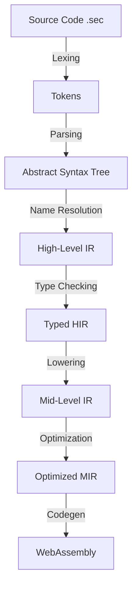

# SwiftSC-Lang Compiler Architecture

> **Status**: Phase 2 Design  
> **Date**: 2025-12-17  
> **Author**: Compiler Engineering Team

## 1. Overview

The SwiftSC-Lang Compiler (`swiftsc`) is a multi-pass compiler written in Rust.
It transforms high-level SwiftSC-Lang source code (`.sec`) into efficient
WebAssembly (`.wasm`) modules.

## 2. Compilation Pipeline



### 2.1 Frontend

- **Lexer**: Hand-written state machine for maximum speed. Handles UTF-8 source.
- **Parser**: Recursive descent parser. Produces a concrete syntax tree (CST) that
  preserves comments/whitespace (for LSP).
- **AST**: Simplified tree for consumption by analyzer.

### 2.2 Semantic Analysis (Middle-end)

- **Symbol Table**: Scoping rules and name resolution.
- **Type Checker**: Bidirectional type checking (inference for locals, explicit
  types for function signatures).
- **Borrow Checker**: Simplified linear-type checker. Verifies resource linearity
  and ownership rules.

### 2.3 Intermediate Representation (MIR)

A Control Flow Graph (CFG) based IR, similar to Rust's MIR but simpler.

- Explicit data dependencies.
- Basic blocks.
- SSA form (Static Single Assignment).

### 2.4 Backend (Codegen)

- **Target**: `wasm32-unknown-unknown`.
- **Strategy**: Direct translation from MIR to WASM instructions.
- **No LLVM**: For the MVP, we will emit WASM directly to maintain fast compile
  times and avoid the massive LLVM dependency. Future versions may add an
  optional LLVM backend for extreme optimization.

---

## 3. Key Components

| Crate | Description |
|:---|:---|
| `swiftsc_driver` | CLI entry point and orchestration. |
| `swiftsc_syntax` | Lexer, Parser, AST definitions. |
| `swiftsc_sem` | Semantic analysis, type checking. |
| `swiftsc_mir` | Intermediate representation definitions. |
| `swiftsc_codegen` | WASM emission logic. |
| `swiftsc_std` | Standard library (embedded). |

---

## 4. Error Handling

The compiler uses a `Diagnostic` system that reports rich errors with source
spans.

```text
error[E0381]: use of moved value: `token`
  --> src/main.sec:14:5
   |
12 |     let token = mint();
   |         ----- move occurs because `token` has type `Resource`, which does
   |               not implement the `Copy` trait
13 |     deposit(token);
   |             ----- value moved here
14 |     dbg(token);
   |         ^^^^^ value used here after move
```

## 5. Technology Stack

- **Language**: Rust (Latest Stable).
- **Parer Library**: `chumsky` or Hand-written (TBD Phase 3).
- **WASM Tools**: `wasm-encoder` crate for generating binaries.
- **Testing**: `insta` for snapshot testing of AST/IR.

## 6. Future Extensibility

The architecture allows plugging in new backends (e.g., eBPF for Solana, EVM
bytecode) by swapping the Codegen pass, assuming the semantics map reasonably
well.
